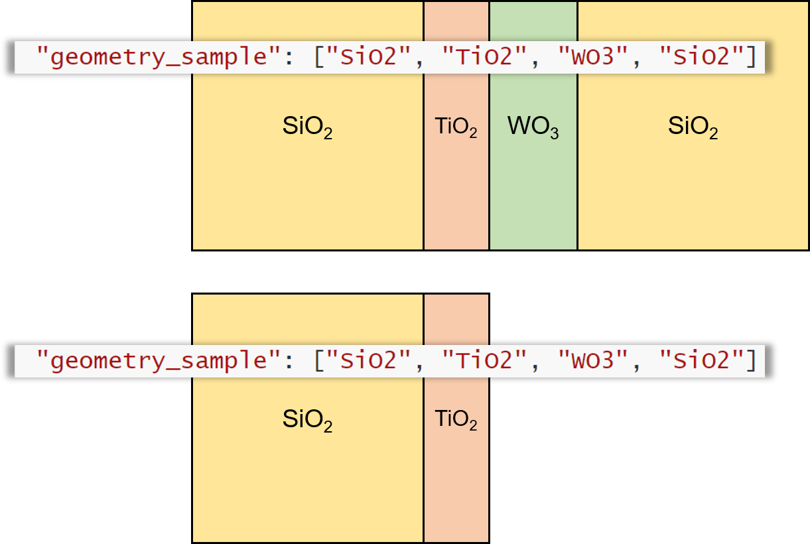

# Overview

*Nelly* is a package for numerically extracting the refractive indices of materials from time-domain THz (TDS) data. The picture below depicts a THz pulse passing through a layered sample.  Upon passing through each layer, the amplitude and phase of the each frequency component of the pulse will be changed in a manner than depends on the layer's **refractive index** and **thickness**. This can be expressed as follows

> $\frac{\tilde{E}_{s}}{\tilde{E}_{r}}(\omega) = TF(\omega, n_\text{solve}, n_1, n_2,...)$

where $n_\text{solve}$ is the unknown refractive index and the transfer function $TF_s(\omega, n_\text{solve})$ is a function made up of Fresnel coefficients and propagation terms.[^1] The complex ratio $\frac{\tilde{E}_{s}}{\tilde{E}_{r}}(\omega)$ is measured experimentally, so once we have the transfer function, we can go frequency-by-frequency and find the refractive index $n_\text{solve}$ which best reproduces the experimental value. 

With this in mind, we have the following tasks:

1. For a given geometry, construct the appropriate transfer function
2. Loop through a range of frequencies and fit the refractive index to the experimental value at that frequency. 

[^1]: More details can be found in this [TDS tutorial by Neu et. al.](https://aip.scitation.org/doi/full/10.1063/1.5047659)  

# Input File

Broadly, the input file has two parts: (1) settings, which controls various data processing parameters, and (2) sample specification,  which gives information about the materials which make up the sample, and specifies the order they come in (i.e. the geometry). 

The input file is in the [JSON](https://en.wikipedia.org/wiki/JSON) format; a sample input file is included with the package.

## Settings

The settings part of the input file controls things like the frequency range and spacing, and parameters for the Fourier transforms. An example of this part of the transfer function is included below with comments to explain each line. Note that comments **cannot** be included in an actual input since it will not parse correctly. 

```json
"settings":
{
    // specifying the frequency range
    // the refractive index will be calculated at each 
    // frequency between freq_lo and freq_hi with step size
    // freq_step
    "freq_lo": 0.2,
    "freq_step": 0.2,
    "freq_hi": 2.2,
    
    //specifying fft settings
    "fft" : {
        "windowing_type": "none",  //specifies the type of windowing
        						   //used to suppress noise in the
        			               //time domain traces. 
                                   // options are: 
        						   //   "gauss", "square", "none"
                                   // see TD_window.m for more info
        
        "windowing_width": 2,      // the width of the window 
        						   // for square windows, this is
                                   //    just the width.
        	                       // for gauss windowing, this is
        						   //    the std dev
        
        "padding": 16,             // the base 2 log of the padding,
                                   // i.e. this pads the time 
                                   // domain data to length 2^16
                                   // prior to Fourier transforming 
    }
}
```


## Sample Specification

The sample specification has two parts. First, the materials that make up the sample are defined--i.e. we associate `"mat1"` with a thickness and refractive index. Then, we specify the geometry by making a list of these materials, i.e. `["mat1", "Si", "mat2"]`. It assumed that the specified geometry is surrounded by air. Below is an example of this part of the input file with comments. Reminder: do not include comments in real input files since they will not be parsed properly. 

```json
"materials":
{
    // for each material, specify a thickness ("d")
    //                    and a refractive index ("n")
    // "d" is given in um
    // "n" is either a constant value (see "SiO2" entry below), 
    //               a data file (csv, with frequencies in THz)
    //            or "solve", which means that this is the 
    //                       refractive index we are solving for
    "SiO2": {"d": 1000, "n": 2},
    "TiO2": {"d": 1,    "n": 'tio2.csv'},
    "WO3" : {"d": 2,    "n": "solve"}
}

// the geometry entries determine the order in which the layers 
// appear in the sample and reference. See the picture below for 
// the geometries specified here.
"geometry_sample": ["SiO2", "TiO2", "WO3", "SiO2"],
"geometry_reference": ["SiO2", "TiO2"]

```



# How to run

`nelly_main(inputfile_path, t_smp, e_smp, t_ref, e_ref)`

# Functions

This section describes each of the functions in the package. For all functions, a description of the expected input is given. For important ("Primary") functions, a fuller description of the function is given as well. 

## Primary functions

1. `nelly_main` takes in an input file name and two time traces and returns a vector for the resulting calculated refracted refractive index, as well as the one for the corresponding frequencies. Conceptually, the code and be broken up into a few steps.

   1. **Loading and processing experimental data** 
      1. Load settings and geometry from the input file. 
      2. Process experimental data: pad, Fourier transform, and calculated experimental transfer function
   2. **Build transfer function** This is simply a matter of taking the geometries loaded from the input file and handing them off to the `build_transfer_function` function.
   3. **Fitting** Loops through the frequencies specified in the input file and finds the refractive index $n$ that best reproduces the experimental transfer function at that frequency. This optimization is done with MATLAB's `fminsearch` function from the Optimization Toolbox.

2. `build_transfer_function` takes in layer information (a structure) and returns a function which takes two arguments: $n$ and $\omega$. The function returns four functions: 

   - the predicted transfer function at frequency $\omega$ assuming the unknown refractive index is $n$ 

   - the propagation terms in the transfer function

   - the transmission terms 

   - the Fabry-Perot term

   These extra functions are used for debugging and testing. Each of the functions is built by looping through the specified geometry. 

   Some comments on the Fabry-Perot terms:
   The code uses two methods for determine the number of reflections to include in the Fabry-Perot terms: a **time criterion**, and an **magnitude criterion**. The **time criterion** will cut off any reflections that appear more than `t_cut` picoseconds after the main pulse--i.e. if the 2nd reflection appeared at 5.1 ps and `t_cut` = 5 ps, then only first reflection would be included. The **magnitude criterion** will cut off any reflections that have a magnitude less than `a_cut`. 

## Auxiliary functions


1. `load_input` loads input file and returns a structure containing relevant data. Also checks input for errors, adds air terms to geometry structure.
2. `fft_func` takes two arguments which define the time domain trace --`A` and `t` -- as well as the number of points to pad the FFT (`N`). It returns the frequency vector (in THz) and result of the 
3. `TD_window` windows the time domain trace to suppress etalons

## Testing 

This package has a suite of tests, which can be run in order to ensure the code is working properly. To run these tests, run the command `runtests`.

