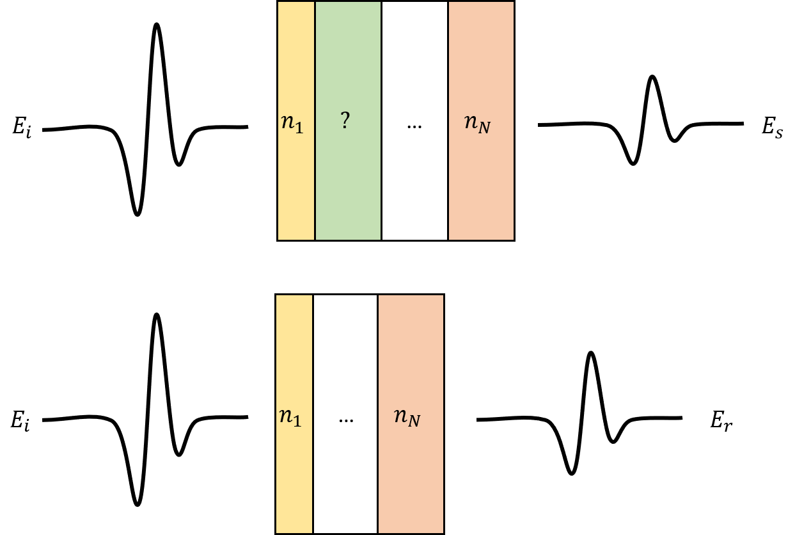
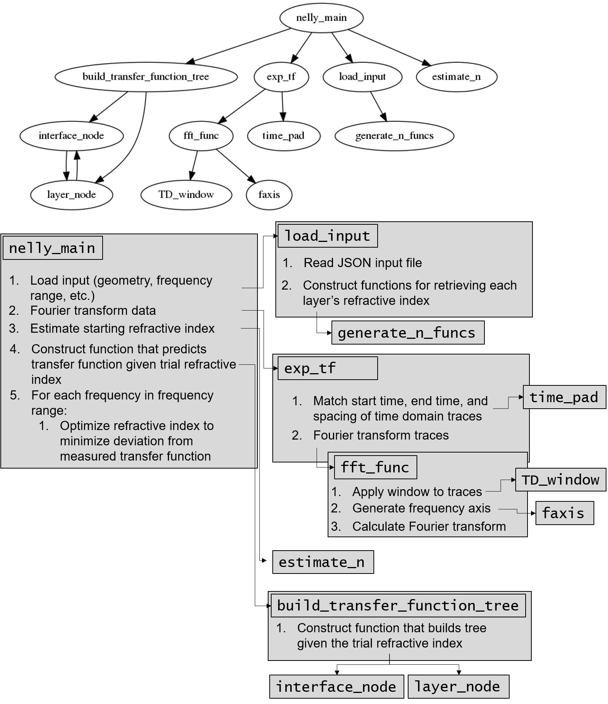
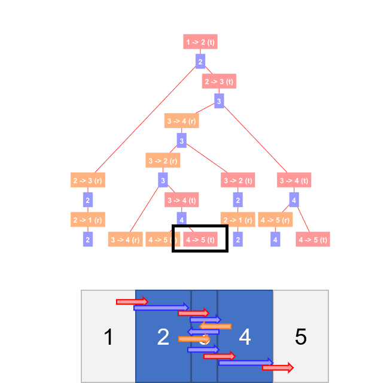
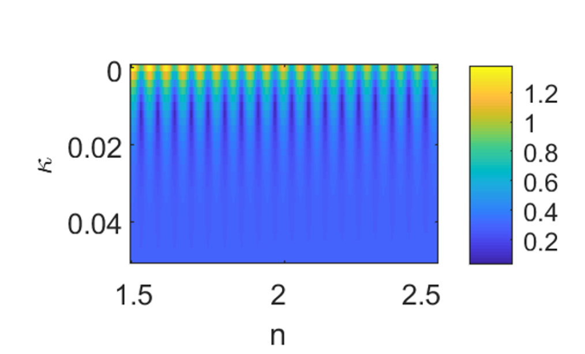
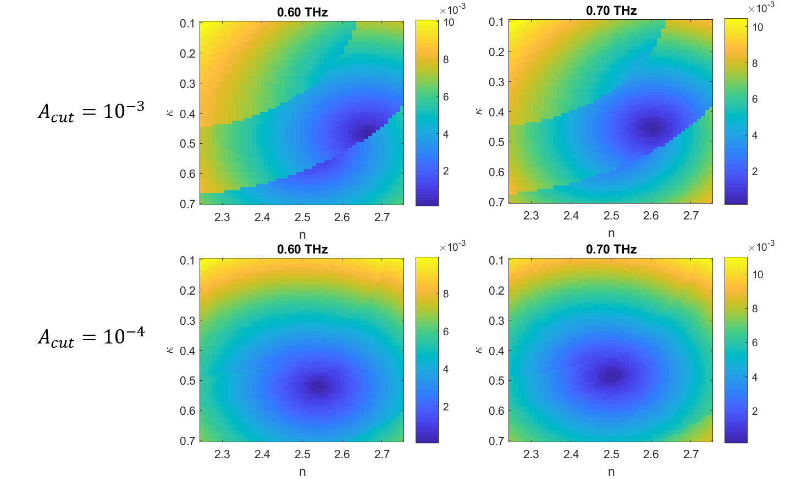

[TOC]

# Overview

*Nelly* is a package for numerically extracting the complex refractive indices of materials from time-domain terahertz (THz) spectroscopy (TDS) and time-resolved THz spectroscopy (TRTS) data. Typically, extracting the refractive index is accomplished by making one of several assumptions about the material (e.g. assuming that only absorptions contribute to the signal). These assumptions limit the accuracy of the results, and restrict analysis to certain types of samples. *Nelly*, on the other hand, does not require any of these assumptions and can process data from a wide range of sample geometries accurately.

TDS and TRTS datasets typically consist of two measurements: (1) a THz pulse that has passed through the sample, and (2) a terahertz pulse that has passed through a known reference. The picture below depicts this general setup, with a THz pulse passing through a layered reference in which all the layers are well characterized, as well as through a sample which contains a layer whose refractive index we'd like to measure. 

The general principle of these measurements is that we can relate the differences between the sample and reference pulse with the unknown refractive index. Specifically, we can Fourier transform the pulses and and see how the amplitude and phase of each spectral component changes when passing through the sample (compared with the reference). We can express this as the transfer function $\frac{\tilde{E}_{s}}{\tilde{E}_{r}}(\omega)$, i.e. the complex ratio of the sample and reference. This change in amplitude and phase can be related to a function of each of the layer's **refractive index** and **thickness**, i.e.:

> $\frac{\tilde{E}_{s}}{\tilde{E}_{r}}(\omega) = TF(\omega, \tilde{n}_\text{solve}, \tilde{n}_1, d_1, \tilde{n}_2,...)$

where $n_\text{solve}$ is the unknown refractive index and the transfer function $TF(\omega, \tilde{n}_\text{solve})$ is a function consisting of Fresnel coefficients and propagation terms.[^1][^2] This can be written more succinctly as $TF(\omega, \tilde{n}_\text{solve})$ since all $n_i$ except $n_{solve}$ are known, as are all $d_i$. The complex ratio $\frac{\tilde{E}_{s}}{\tilde{E}_{r}}(\omega)$ is measured experimentally, so once we have the transfer function, we can go frequency-by-frequency and find the refractive index $\tilde{n}_\text{solve}$ which best reproduces the experimental value---that is, what value of $\tilde{n}_{solve}$ brings $TF(\omega, \tilde{n}_{solve})$  closest to the measured value of $\frac{\tilde{E}_{s}}{\tilde{E}_{r}}(\omega)$

With this in mind, the package performs the following tasks:

1. For a given geometry, constructs the appropriate transfer function
2. Loops through a range of frequencies, and run an optimization routine that finds the refractive index that most closely matches the transfer function to the experimental value.


# Quick Start

## In MATLAB

The quickest way to get started is to edit the sample script and input file in the `sample_files` folder to fit your needs.

1.  **Editing the script**
   In `sample_files/sample_script` replace the data file paths (e.g. `'../test_data/cell_ref_empty.tim'`) with paths for your data files. The built in `importdata` method should work for most character-delimited data files, but any import method works as long as you end up with a MATLAB vector for the time points, and a corresponding vector with the amplitudes for each time.
2. **Editing the input file**
   The input file specifies the geometry of the sample as well as some parameters for the Fourier transform. In `sample_files/sample_input.json`, change the parameters and geometry as necessary to match your sample and reference. This file can edited in any text editor. Each parameter is explained in comments as is the format for the geometry specification.

## In Python

The Python library depends on the freely available MATLAB runtime. This can be installed by following the instructions on the [MATLAB website](https://www.mathworks.com/products/compiler/matlab-runtime.html). Another option on Linux systems is to navigate to `nelly_main/for_redistribution` within the main package folder and run the installer there with the command`./MyAppInstaller_web.install`. 

With the MATLAB runtime installed, the Python library can be installed by navigating to `nelly_main/for_redistribution_files_only` within the main package folder and running `python3 setup.py --install`. To test the installation, you can then try running the sample script in the sample folder with `python3 example_script.py`. This example script can then also be edited to suit your needs.

**Caveats and Troubleshooting Hints**

* You may have to manually add the MATLAB runtime directory to your `LD_LIBRARY_PATH`. This can be done by running the command `export LD_LIBRARY_PATH=$LD_LIBRARY_PATH:<MATLAB runtime path>`. The MATLAB runtime path will be shown during the MATLAB runtime installation process. An example can be found in `add_to_path.sh`.
* This installation process has only been successfully tested on Linux (Ubuntu 20.04). We ran into issues (file permissions, getting correct path) when installing on Windows 10.

# How to Run *Nelly* #

The main interface to the program is the `nelly_main` function. `nelly_main` takes in the input file and the time-domain data and outputs the extracted refractive index along various diagnostic variables. It can be run as follows:

`[freq, n_fit, freq_full, tf_full, tf_spec, tf_pred, func, spec_smp, spec_ref]...
    = nelly_main(input, t_smp, A_smp, t_ref, A_ref)`

See below for a more detailed explanation of the input and output arguments. Briefly, `input` is the path name to the input file,  `t_smp`  and `A_smp` are time points and amplitudes for the sample, and `t_ref` and `A_ref` are the same for the reference.

## Input File

Broadly, the input file has two parts: (1) settings, which controls various data processing parameters, and (2) sample specification,  which gives information about the materials which make up the sample, and specifies the order they come in (i.e. the geometry). 

The input file follows the [JSON](https://en.wikipedia.org/wiki/JSON) format, except that comments are allowed (beginning with `//`). A sample input file is included with the package (any of the JSON files in the `test_data` folder. These files can be edited with any text editor.

### Settings

The settings part of the input file controls the amplitude cutoff, frequency range and spacing, and the parameters for the Fourier transforms. An example of this part of the transfer function is included below with comments to explain each line. 

```json
"settings":
{
    "a_cut": 6e-5,  // amplitude cutoff for reflections 
                    // (see build_transfer_function_tree section below)
    
    // specifying the frequency range
    // the refractive index will be calculated at each 
    // frequency between freq_lo and freq_hi with step size
    // freq_step
    "freq_lo": 0.2,
    "freq_step": 0.2,
    "freq_hi": 2.2,
    
    //specifying fft settings
    "fft" : {
        "windowing_type": "none",  //specifies the type of windowing
        						   //used to suppress noise in the
        			               //time domain traces. 
                                   // options are: 
        						   //   "gauss", "square", "none"
                                   // see TD_window.m for more info
        						   // Since the package is designed to handle 
                                   // reflections and other features that may
                                   // be removed in the windowing, windowing 
                                   // is discouraged.
        
        "windowing_width": 2,      // the width of the window 
        						   // for square windows, this is
                                   //    just the width.
        	                       // for gauss windowing, this is
        						   //    the std dev
        
        "padding": 16,             // the base 2 log of the padding,
                                   // i.e. this pads the time 
                                   // domain data to length 2^16
                                   // prior to performing the FFT
    }
}
```


### Geometry Specification

The next portion of the input file gives the geometries for the sample and reference.  Each of these geometries consists of an array of layers, each containing fields for the name of the layer, the thickness of the layer in micrometers (`d`), and the (complex) refractive index of the layer (`n`).  The name is included only for clarity--it is not used in the program. There are a number of options for specifying the refractive index: 

* `"solve"` (denoting the layer whose refractive index we're solving for)
* A number (including complex values)
* A path to a file containing the frequency-by-frequency refractive index. The code accepts files in the csv format, with the first column denoting the frequency (in THz), the second column giving the real part, and the (optional) third column giving the imaginary part. Other formats may work as well, provided they follow this general format and are compatible with MATLAB's `importdata` function.

If the reference is not specified, it is assumed to be air (with the same thickness as the sample). 

The example below shows the geometry specification for an experiment measuring the refractive index of water in a quartz cell with the empty cell as the reference.

```json
"sample":
    [
	{"name": "air",      "d": 0,    "n": 1},
	{"name": "quartz",   "d": 1250, "n": 'quartz.csv'}, 
	{"name": "water",    "d": 100,  "n": "solve"},
	{"name": "quartz",   "d": 1250, "n": 'quartz.csv'},
	{"name": "air",      "d": 0,    "n": 1}
    ],
    
    "reference":
    [
    {"name": "air",      "d": 0,    "n": 1},
	{"name": "quartz",   "d": 1250, "n": 'quartz.csv'}, 
	{"name": "air",      "d": 100,  "n": 1},
	{"name": "quartz",   "d": 1250, "n": 'quartz.csv'},
	{"name": "air",      "d": 0,    "n": 1}
    ]

}

```

# Functions And Classes

This section describes each of the functions and classes in the package. For all functions, a description of the expected input is given. For important ("Primary") functions, a fuller description of the function is given as well. To give a sense of the overall architecture of the library, the relationship between the functions is shown in the diagram below, where the arrows point to the functions called by each function. Although most users will only call `nelly_main`, the explanations of the other functions may be helpful in diagnosing bugs or useful for users who want to customize the code for their particular purposes. All times are in picoseconds (ps) and all frequencies are in THz.




## Primary functions

1. `nelly_main` takes in an input file name and two time traces and returns a vector for the extracted refractive index. Conceptually, the code can be broken up into the following steps.

   1. **Loading and processing experimental data** 
      1. Load settings and geometry from the input file (`load_input`). 
      2. Process experimental data: pad (`time_pad`), Fourier transform (`fft_func`), and use these results to calculate the  experimental transfer function (`exp_tf`)
   2. **Build transfer function** Take the geometries loaded from the input file and hand them off to the `build_transfer_function_tree` function.
   3. **Fitting** Loops through the frequencies specified in the input file and finds the refractive index $n$ where the predicted transfer function best reproduces the experimental transfer function at that frequency (i.e. minimizes the error defined by $Error(\omega) = \left(\log(|TF(\omega)|)-\log(|TF_{exp}(\omega|)\right)^2 + \left((\angle TF(\omega) - \angle TF_{exp}(\omega) + \pi \mod 2\pi )-\pi \right)^2$) This optimization is done with MATLAB's `fminsearch` function.

   *Arguments*

   * `input` : gives input geometry and other settings for the calculation. This can either be a filename for a JSON file (see specification above) or a MATLAB struct variable containing the same information. 
   * `t_smp` : an array containing time points for the sample time domain trace (in ps)
   * `A_smp` : an array containing the sample pulse amplitude points corresponding to `t_smp` 
   * `t_ref` : an array containing time points for the reference time domain trace (in ps)
   * `A_ref` : an array containing the reference pulse amplitude points corresponding to `t_ref`

   *Output*

   * `freq`: an array containing the frequencies (THz) at which the refractive index was calculated
   * `n_fit`: an array of complex values for the refractive index. The $i^{th}$ element corresponds to the $i^{th}$ element in `freq`. For the imaginary part, positive values correspond to loss.
   * `freq_full`: an array containing a finer mesh of frequency points directly from the padded Fourier transform.
   * `tf_full`: an array containing the transfer function ($\frac{E_{smp}}{E_{ref}}$). The $i^{th}$ element corresponds to the $i^{th}$ element in `freq_full`
   * `tf_spec` : an array containing the transfer function ($\frac{E_{smp}}{E_{ref}}$) at a coarser spacing. The $i^{th}$ element corresponds to the $i^{th}$ element of `freq`
   * `tf_pred`: an array containing the transfer function predicted based on the extracted refractive index values (i.e. $TF(\tilde{n}_{extracted},\omega)$. The can be compared with the experimental transfer function to assess the accuracy of the extracted refractive index. The $i^{th}$ element corresponds to the $i^{th}$element of `freq`
   * `func`: a function which takes two arguments -- a frequency (in THz) and the value for the unknown refractive index--and returns the predicted transfer function values at that frequency assuming that the unknown refractive index is the value given. 
   * `spec_smp`: the spectrum (i.e. the Fourier coefficients) for the sample pulse (i.e. $E_{smp}(\omega)$ ). The $i^{th}$element corresponds to the $i^{th}$ element of `freq`.
   * `spec_ref` : the spectrum (i.e. the Fourier coefficients) for the reference pulse (i.e. $E_{ref}(\omega)$). The element corresponds to the $i^{th}$ element of `freq`.

2. `build_transfer_function_tree` takes in layer information and returns the transfer function used for the refractive index extraction. Briefly, it does this by considering every possible path the pulse can take through the sample. At each interface, the pulse can either be reflected or transmitted. This is represented in a tree which splits at each interface. This is illustrated in the diagram below:  
   

   Here the tree starts at the interface between layer 1 (air) and layer 2. After passing through layer 2, the pulse will reach the `2->3` interface and either be reflected or transmitted, so the tree splits into `2->3 (t)` and `2->3(r)` branches. This process then continues for each of the branches. Each given node of the tree corresponds to a particular path in the geometry. For example the node in the black box corresponds to the path shown in the errors in the diagram below the tree (i.e. passing though layer 2, reflecting back and forth in layer 3 then transmitting through layer 4 and finally leaving the sample). Each of these paths will correspond to a particular time delay (the time required to traverse the path) as well as a change in amplitude (losses due to absorption and at interfaces). By keeping track of these, we can terminate any branch with a time delay that would place it outside our measurement window, or with an amplitude less than `a_cut` (specified in input). More details can be found in the main text of the paper.

   The function `build_transfer_function_tree` takes a struct variable containing the geometry (`geom`) as well as time and amplitude cutoffs (`t_cut` and `a_cut`), and returns two functions:

   * `tf_func`, which takes a frequency and a value for the unknown refractive index and returns the predicted $\frac{E_{smp}}{E_{ref}}(\omega)$.
   * `tree_func`, which takes a frequency and a value for the unknown refractive index and returns an object representing the tree of pulse paths. This can be used for debugging (e.g. visualizing the tree).

## Auxiliary functions/classes

1. `estimate_n` gives an estimate of the real part of the unknown refractive index based on the sample and reference geometries and the delay between the peak of the sample pulse and the peak of reference pulse.
   *Arguments*

   1. `delay`: time delay (in ps) between the peak of the sample pulse and the peak of the reference pulse.
   2. `input`: a struct variable containing the frequency range and sample geometries. This can be created by calling `load_input` on an input file or by creating a struct variable with the required fields manually.

   *Output*

   1. `n_est`: the estimate for the real part of the unknown refractive index.

      
   
2. `exp_tf` Pads, windows, and Fourier transforms the raw time traces.
   *Arguments* 

   1. `t_smp` : an array containing time points for the sample time domain trace (in ps).
   2. `A_smp` : an array containing the sample pulse amplitude points corresponding to `t_smp`.
   3. `t_ref` : an array containing time points for the sample time domain trace (in ps).
   4. `A_ref` : an array containing the reference amplitude points corresponding to `t_ref`.
   5. `input`: a struct variable containing the frequency range and sample geometries. This can be created by calling `load_input` on an input file or by creating a struct variable with the required fields manually.

   *Output*

   1. `freq`: an array containing the frequencies (THz) at which the refractive index was calculated.
   2. `tf_spec` : an array containing the transfer function ($\frac{E_{smp}}{E_{ref}}$) at a coarser spacing. The $i^{th}$ element corresponds to the $i^{th}$ element of `freq`.
   3. `freq_full`: an array containing a finer mesh of frequency points directly from the padded Fourier transform.
   4. `tf_full`: an array containing the transfer function ($\frac{E_{smp}}{E_{ref}}$). The $i^{th}$ element corresponds to the $i^{th}$ element in `freq_full`.
   5. `spec_smp`: the spectrum (i.e. the Fourier coefficients) for the sample pulse (i.e. $E_{smp}(\omega)$ ). The $i^{th}$element corresponds to the $i^{th}$ element of `freq`.
   6. `spec_ref` : the spectrum (i.e. the Fourier coefficients) for the reference pulse (i.e. $E_{ref}(\omega)$). The element corresponds to the $i^{th}$ element of `freq`.

3. `fft_func` Fourier transforms a time-domain trace. It takes the time and amplitude as vector arguments, as well as struct object containing options for the Fourier transform (e.g. zero padding, windowing). It returns the frequency vector (in THz) and the corresponding complex Fourier coefficients.

   *Arguments*

   1. `time`: The time points of the TDS/TRTS trace to be Fourier transformed (in ps)
   2. `amplitude`: The amplitudes of the time trace to be Fourier transformed, corresponding to the time points in `time`
   3. `options`:  a struct variable with following fields:
      1. `windowing_type`: a string specifying the type of windowing to perform on the time domain data (either 'square', 'gauss', or 'none'). Since *Nelly* models all reflections and windowing suppresses later reflections, we typically recommend using no windowing (i.e. 'none').
      2. `windowing_width`: the width of the window in ps. For Gaussian windowing ('gauss'), this value gives is twice the standard deviation. For a square window ('square' ), this values gives the full width of the window. In both cases, the window is centered around the maximum amplitude of the time trace.

   *Output*

   1. `amplitude_windowed`: the revised amplitude after applying the windowing.

4. `faxis` is a function for determining the appropriate frequency scale for a discrete Fourier transform. It generates an array containing the frequency points (in THz) for the input time axis (in ps).
   *Arguments*

   1. `t`: the time points (in ps) for the trace to be Fourier transformed.
   2. `N`: the number of points in the discrete Fourier transform.

   *Output*

   1. `f` : an array of frequency values (in THz). 
   2. `df`: the frequency step size (in THz).
   3. `Nt`: the length of the input time vector.
   4. `dt`: the time step (assumed to be uniform).

5. `load_input` loads input file and returns a structure containing relevant data. Also checks input for errors, adds air terms to geometry structure, and generates functions for retrieving the refractive index of each layer.

   *Arguments*

   1. `source`: the source of the input data, either a filename (pointing a JSON file as discussed in the Input File section) or a MATLAB struct containing the same information.

   *Output*

   1. `input`: a MATLAB struct containing the data processing parameters and geometries as well functions for retrieving the refractive index for each layer.

6. `TD_window` windows the time domain trace to suppress etalons. 

   *Arguments*

   1. `time`: the time axis for the trace to be windowed (in ps).
   2. `amplitude`: the amplitude points for the trace to be windowed.
   3. `type`:  a string specifying the type of windowing to perform on the time domain data (either 'square', 'gauss', or 'none'). Since *Nelly* models all reflections and windowing suppresses later reflections, we typically recommend using no windowing (i.e. 'none').
   4. `width`: the width of the window in ps. For Gaussian windowing ('gauss'), this value gives is twice the standard deviation. For a square window ('square' ), the gives the full width of the window. In both cases, the window is centered around the peak amplitude of the time trace.

   *Output*

   1. `amplitude_windowed`: the amplitude points after applying the windowing.

7. `time_pad` pads two traces to match their time points. Differences in spacing are accommodated by interpolating the traces with the finer spacing. Differences in the end points (i.e. if one trace goes to longer times than the other) are accommodated by padding the shorter trace with zeros.

   *Arguments*

   1. `t_smp`: the time points for the first trace (in ps).
   2. `A_smp`: the amplitudes for the first trace.
   3. `t_ref`: the time points for the second trace (in ps).
   4. `A_ref`: the amplitudes for the second trace.

   *Output*

   1. `t`: the resulting padded time axis
   2. `A_smp_pad`: the revised amplitude (interpolated and padded) for the first trace.
   3. `A_ref_pad`: the revised amplitude (interpolated and padded) for the second trace.

8. `tf_node` is a class used for handling the tree nodes. The two types nodes (layer and interface) are handled in two classes that inherit from `tf_node`: `layer_node` and`interface_node` respectively. The constructors for these classes are as follows:

   1. `layer_node`

      *Arguments*

      `index`: the index of the layer in the structure (the first layer is 1).
      
      `dir`: the direction the pulse is traveling through the layer. Its values can be +1 if its travelling forwards (i.e. away from the first layer) or -1 if it's travelling towards the first layer.
      
      `t_prev`: the time accumulated upon reaching this node (in ps). This is used for checking the time cutoff.
      
      `amp_prev`: the amplitude of the pulse upon reaching this node. This is used for checking the amplitude cutoff.
      
      `geom`: a struct array containing the geometry of the material in question. This is usually generated by the `load_input` function.
      
      `freq`: the frequency for which we are constructing the transfer function.
      
      `n_solve`: the trial value for the unknown refractive index.
      
      `t_cut`: the time cutoff (in ps), measured relative to when the pulse impinges on the first layer. Any paths which would take longer than this are terminated.
      
      `a_cut`: the amplitude cutoff relative to the amplitude of the pulse before it impinges upon on the first layer. For example, a value of `1e-3` would terminate any paths with an amplitude less than one thousandth of the initial amplitude.
      
      `parent`: contains a reference to the parent node.
      
   2. `interface_node`
   
      *Arguments*
   
      `from`: the index of layer the pulse travelled through before reaching the current interface. The first layer has index 1.
   
      `into`: the index of the layer the pulse would travel into if transmitted through the interface.
   
      `type`: specifies whether the pulse is being transmitted or reflected at the current interface (-1 if reflected, +1 if transmitted).
   
      `t_acc`: the time accumulated upon reaching this node (in ps). This is used for checking the time cutoff.
   
      `amp_prev`: the amplitude of the pulse upon reaching this node. This is used for checking the amplitude cutoff.
   
      `geom`: a struct array containing the geometry of the material in question. This is usually generated by the `load_input` function.
   
      `freq`: the frequency for which we are constructing the transfer function.
   
      `n_solve`: the trial value for the unknown refractive index.
   
      `t_cut`: the time cutoff (in ps), measured relative to when the pulse impinges on the first layer. Any paths which would take longer than this are terminated.
   
      `a_cut`: the amplitude cutoff relative to the amplitude of the pulse before it impinges upon on the first layer. For example, a value of `1e-3` would terminate any paths with an amplitude less than one thousandth of the initial amplitude.
   
      `parent`: contains a reference to the parent node.
   
      

## Utilities ##

Several post processing and debugging utilities can be found in the `utilities` folder. The functions can be used for processing the extracted refractive index to obtain other properties (permittivity, conductivity, etc.) as well for debugging.

1. `drude_fit` Fits the given conductivity to the Drude model. The conductivity can be calculated from the refractive index output with the `n_to_photocond` function discussed below.

   *Arguments*

   `freq`: the frequency points in the conductivity trace in THz.

   `cond`: the conductivity at each of the frequencies specified in `freq` (in S/m).

   *Output*

   `x`: an array containing the fit parameters. The first element gives the DC conductivity in S/m, the second gives the scattering time in ps.

   `func`: a function which takes in Drude fit parameters and returns the predicted conductivity. For example, the fit can be plotted with the command `plot(freq, func(x))`.

2. `drude_smith_fit` Fits the given conductivity to the Drude-Smith model.

   *Arguments*

   `freq`: the frequency points in the conductivity trace in THz.

   `cond`: the conductivity at each of the frequencies specified in `freq` (in S/m).

   *Output*

   `x`: an array containing the fit parameters. The first element gives the DC conductivity in S/m, the second gives the scattering time in ps, and the third gives the c parameter (persistence of velocity).

   `func`: a function which takes in Drude-Smith fit parameters and returns the predicted conductivity. For example, the fit can be plotted with the command `plot(freq, func(x))`.

3. `error_map` Takes a transfer function, the experimental transfer function, and ranges for the real and imaginary parts of the refractive index. Generates an error map showing the deviation between the experimental value and the transfer function prediction for each refractive index in the ranges given. This can be used to check the minimization landscape for local minima, for example. The error is given by $Error(\omega) = \left(\log(|TF(\omega)|)-\log(|TF_{exp}(\omega|)\right)^2 + \left((\angle TF(\omega) - \angle TF_{exp}(\omega) + \pi \mod 2\pi )-\pi \right)^2$

   *Arguments*

   `func`: the transfer function to assess.

   `tf_exp`: the experimental transfer function to compare with `func`.

   `tf_freq`: the frequency points corresponding to the data in `tf_exp`.

   `n`: an array containing the values for the real part of refractive index to test. `func` will be compared with `tf_exp` for all values of`n(i) + 1i*k(j)`.

   `k`: an array containing the values for the imaginary part of refractive index to test. `func` will be compared with `tf_exp` for all values of`n(i) + 1i*k(j)`.

   *Output*

   `maps`: a cell array of matrices, one for each frequency in `tf_freq`. Each matrix contains the error between `func` and `tf_exp` at each refractive index value tested. In other words `maps{ii}(index_k, index_n)` contains the error for refractive index `n(index_n) + 1i*k(index_k)` at frequency `tf_freq(ii)`. To visualize these maps, the `imagesc` command is helpful (e.g. `imagesc(maps{ii})`). The rows of these matrices correspond to different values for the imaginary part of the refractive index, while the columns correspond to different values for the real part.

4. `just_propagation` extracts the refractive index from the experimental transfer function  assuming all changes in amplitude and phase are due to propagation  through the unknown layer (i.e. no reflections). This can be used as a  rough check for simple cases.

   *Arguments*

   `freq`: the frequency points for the given experimental transfer function.

   `tf_spec`: the experimental transfer function corresponding to the frequency points in `freq`.

   `d`: the thickness (in micrometers) of the layer with the unknown refractive index.

   By default, the refractive index of the material the unknown layer is replacing is assumed to be 1. This would be the case when the reference is simply air, or when the reference is an empty cuvette which is then filled with the sample substance. When the sample is replacing a non-air material, the refractive index must be provided by additional arguments: `just_propagation(..., 'n_off', <replaced refractive index>)`

   *Output*

   `freq`: this simply echoes the input `freq`.

   `ref_index`: the extracted refractive index.

   `phase`: the unwrapped phase used to extract the real part of the refractive index. This can be used for debugging.

5. `n_to_photocond` takes the refractive index of a photoexcited material along with its nonphotoexcited index and gives the photoconductivity.

   *Arguments*

   `freq`: the frequencies corresponding to the specified refractive index.

   `n_photo`: An array containing the refractive index of the photoexcited material at each of the frequencies specified in `freq`.

   `n_non`: The non-photoexcited refractive index of the material. It can be given as a scalar for materials with static refractive index, or as an array.

   *Output*

   `sig`: An array containing the photoconductivity (in S/m).

6. `tinkham` extracts the conductivity from the experimental transfer function using the assumptions made by Tinkham and Glover[^3]

   *Arguments*

   `tf_spec`: An array containing the experimental transfer function.

   `d`: the thickness of the unknown layer (in micrometers).

   `nn`: a scalar or array containing the refractive index of the substrate or non-photoexcited material.

   *Output*

   `cond`: conductivity in S/m.

# Testing 

This package has a suite of tests, which can be run in order to ensure the code is working properly. To run these tests, run the command `runtests`.

# Getting Help

For more details on any of the functions, type `help <function name>` in the MATLAB command window. Below are some troubleshooting suggestions. If these suggestions don't resolve your issue, feel free to reach out to uriel [dot] tayvah [at] yale [dot] edu with any questions. You can also submit issues  on the GitHub repository at https://github.com/YaleTHz/nelly/issues.

## Troubleshooting suggestions

In many cases the best troubleshooting approach is to use the `error_map` function to generate maps of deviation between the predicted transfer function and the experimental error function for a range of refractive indices. Below, we discuss some common issues, and show characteristic error maps which can be used to diagnose their root causes.

* **Problem**: Abrupt jumps in extracted refractive index. 

  **Causes**:

  1. **$2\pi$ jumps**: There is an ambiguity in the propagation terms $e^{-ik_0dn}$, since these terms will take on the same value for any $n_i, n_j$ where $k_0dn_i = k_0dn_j + 2N\pi$ for integer $N$. This is a particular problem for thick layers at higher frequencies, where these indistinguishable values lie closer together ($n_i = n_j + 2N\pi/k_0d$). This can be seen in the plots generated by the `error_map` function. An example of an error map for a system susceptible to $2\pi$ jumps is shown below:

     

     Here we can see closely spaced local minima in the error function, which can cause abrupt jumps when the optimization for successive frequencies find different local minima.

     **Solutions**

     1. Eliminating thick layers with referencing: In many cases, the thick layer causing the $2\pi$ jumps is the substrate layer. This thick layer can then be eliminated from the calculation by referencing on the substrate instead of on air. 
     2. Decreasing the frequency spacing: The refractive index optimization routine starts at the optimized value for the previous frequency, which can cause problems when the refractive index is rapidly changing (e.g. near a resonance). In these cases, the starting value may lie in a different local minimum than the true value. To avoid this, a lower frequency spacing can minimize the change in refractive index between each successive frequency point.
     3. Increasing the frequency spacing: Another factor which can push the optimization to incorrect local minima is noise. When many frequency points must be calculated for a fine frequency spacing, fewer data points are averaged per frequency point, leading to higher noise. This can be addressed by increasing the frequency spacing.

  2. **An aggressive amplitude cutoff**: If the amplitude cutoff is set too high, observed reflections will be erroneously ignored. Because the amplitude of the reflection will differ by frequency, it may be below the cutoff at some frequencies, but above the cutoff at others. These abrupt changes in inclusion/exclusion of the reflection can lead to abrupt changes in the extracted refractive index. This can be seen in the error maps shown below. The ridges for `a_cut = 1e-3` disappear when lowered to `a_cut=1e-4`

     

     **Solutions**

     Lower `a_cut` in the input! This can be done gradually, since small values will take quite some time to run.

     

  

# References

[^ 1]: Main text accompanying this paper
[^2]:  (1) Neu, J.; Schmuttenmaer, C. A. Tutorial: An Introduction to Terahertz Time Domain Spectroscopy (THz-TDS). *Journal of Applied Physics* **2018**, *124* (23), 231101. https://doi.org/10.1063/1.5047659.
[^3]: (1) Glover, R. E.; Tinkham, M. Conductivity of Superconducting Films for Photon Energies between 0.3 and $40k{T}_{c}$. *Phys. Rev.* **1957**, *108* (2), 243–256. https://doi.org/10.1103/PhysRev.108.243.

