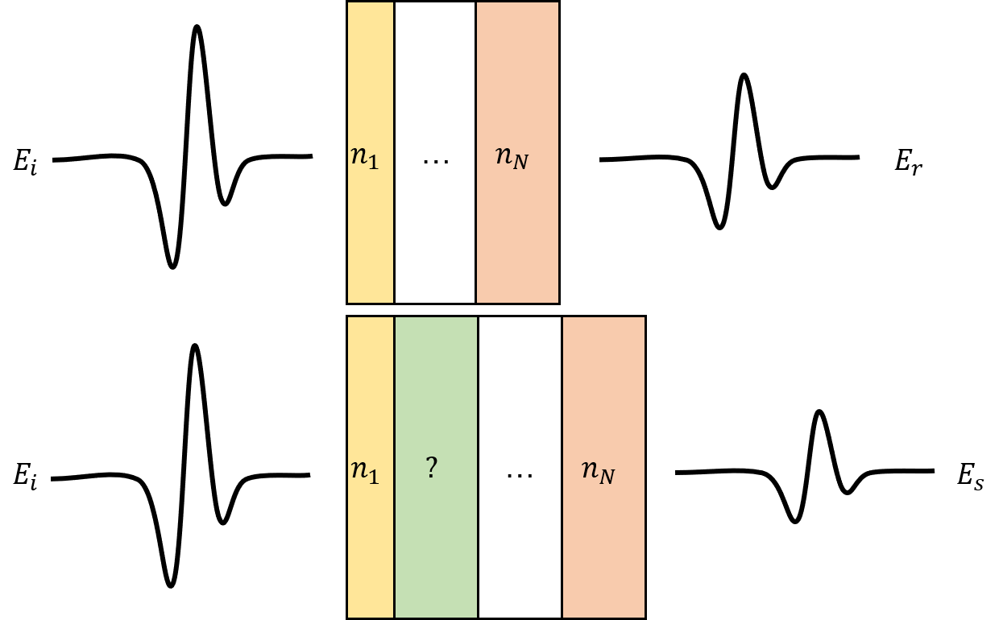

\[TOC\]

Overview
========

*Nelly* is a package for numerically extracting the complex refractive indices of materials from time-domain THz (TDS) and time-resolved THz (TRTS) data. Typically, extracting the refractive index is done by making one of several assumptions about the material (e.g. assuming that only absorptions contribute to the signal). These assumptions limit the accuracy of the results, and restrict analysis to certain types of samples. *Nelly*, on the other hand, does not require any of these assumptions and can process data from a wide range of sample geometries accurately.

TDS and TRTS datasets typically consist of two measurements: (1) a terahertz pulse that has passed through the sample, and (2) a terahertz pulse that has passed through a known reference. The picture below depicts this general setup, with a THz pulse passing through a layered reference in which all the layers are well characterized, as well as through a sample which contains a layer whose refractive index we'd like to measure.

The general principle of these measurements is that we can relate the differences between the sample and reference pulse with the refractive index of the unknown layer. Specifically, we can Fourier transform the pulses and and see how the amplitude and phase of each Fourier component changes when passing through the sample (compared with the reference). We can express this as the transfer function $\\frac{\\tilde{E}\_{s}}{\\tilde{E}\_{r}}(\\omega)$, i.e. the complex ratio of the sample and reference. This change in amplitude and phase can be related to a function of each of the layer's **refractive index** and **thickness** of each layer, i.e.:

> $\\frac{\\tilde{E}\_{s}}{\\tilde{E}\_{r}}(\\omega) = TF(\\omega, \\tilde{n}\_\\text{solve}, \\tilde{n}\_1, d\_1, \\tilde{n}\_2,...)$

where *n*<sub>solve</sub> is the unknown refractive index and the transfer function *T**F*(*ω*, *ñ*<sub>solve</sub>) is a function consisting of Fresnel coefficients and propagation terms.[1] This can be written more succinctly as *T**F*(*ω*, *ñ*<sub>solve</sub>) since all *n*<sub>*i*</sub> except *n*<sub>*s**o**l**v**e*</sub> are known, as are all *d*<sub>*i*</sub>. The complex ratio $\\frac{\\tilde{E}\_{s}}{\\tilde{E}\_{r}}(\\omega)$ is measured experimentally, so once we have the transfer function, we can go frequency-by-frequency and find the refractive index *ñ*<sub>solve</sub> which best reproduces the experimental value---that is, what value of *ñ*<sub>*s**o**l**v**e*</sub> brings *T**F*(*ω*, *ñ*<sub>*s**o**l**v**e*</sub>) closest to the measured value of $\\frac{\\tilde{E}\_{s}}{\\tilde{E}\_{r}}(\\omega)$

With this in mind, we have the following tasks:

1.  For a given geometry, construct the appropriate transfer function
2.  Loop through a range of frequencies and fit the refractive index to the experimental value at each frequency.

Quick Start
===========

The quickest way to get started is to start with the sample script and input file in the `sample_files` folder and edit them to fit your needs.

1.  **Editing the script** In `sample_files/sample_script` replace the data file paths (e.g. `'../test_data/cell_ref_empty.tim'`) with paths for your data files. The built in `importdata` method should work for most character-delimited data files, but any import method works as long as you end up with a MATLAB vector for the time points, and a corresponding vector with the amplitudes for each time.
2.  **Editing the input file** The input file specifies the geometry of the sample as well as some parameters for the Fourier transform. In `sample_files/sample_input.json`, change the parameters and geometry as necessary to match your sample and reference. Each parameter is explained in comments as is the format for the geometry specification.

How to Run *Nelly*
==================

The main interface to the program is the `nelly_main` function. `nelly_main` takes in the input file and the time-domain data and outputs the extracted refractive index along various diagnostic variables. It can be run as follows:

`[freq, n_fit, freq_full, tf_full, tf_spec, tf_pred, func, spec_smp, spec_ref]...     = nelly_main(input, t_smp, A_smp, t_ref, A_ref)`

See below for a more detailed explanation of the input and output arguments. Briefly, `input` is the path name to the input file, `t_smp` and `A_smp` are time points and amplitudes for the sample, and `t_ref` and `A_ref` are the same for the reference.

Input File
----------

Broadly, the input file has two parts: (1) settings, which controls various data processing parameters, and (2) sample specification, which gives information about the materials which make up the sample, and specifies the order they come in (i.e. the geometry).

The input file follows the [JSON](https://en.wikipedia.org/wiki/JSON) format, except that comments are allowed (beginning with `//`). A sample input file is included with the package (any of the JSON files in the `test_data` folder.

### Settings

The settings part of the input file controls things like the frequency range and spacing, and parameters for the Fourier transforms. An example of this part of the transfer function is included below with comments to explain each line.

``` json
"settings":
{
    "a_cut": 6e-5,  // amplitude cutoff for reflections 
                    // (see build_transfer_function_tree section below)
    
    // specifying the frequency range
    // the refractive index will be calculated at each 
    // frequency between freq_lo and freq_hi with step size
    // freq_step
    "freq_lo": 0.2,
    "freq_step": 0.2,
    "freq_hi": 2.2,
    
    //specifying fft settings
    "fft" : {
        "windowing_type": "none",  //specifies the type of windowing
                                   //used to suppress noise in the
                                   //time domain traces. 
                                   // options are: 
                                   //   "gauss", "square", "none"
                                   // see TD_window.m for more info
                                   // Since the package is designed to handle 
                                   // reflections and other features that may
                                   // be removed in the windowing, windowing 
                                   // is discouraged.
        
        "windowing_width": 2,      // the width of the window 
                                   // for square windows, this is
                                   //    just the width.
                                   // for gauss windowing, this is
                                   //    the std dev
        
        "padding": 16,             // the base 2 log of the padding,
                                   // i.e. this pads the time 
                                   // domain data to length 2^16
                                   // prior to Fourier transforming 
    }
}
```

### Geometry Specification

The next portion of the input file gives the geometries for the sample and reference. Each of these geometries consists of an array of layers, each containing fields for the name of the layer, the thickness of the layer in microns (`d`), and the (complex) refractive index of the layer (`n`). The name is included only for clarity--it is not used in the program. There are a number of options for specifying the refractive index:

-   `"solve"` (denoting the layer whose refractive index we're solving for)
-   A number (including complex values)
-   A path to a file containing the frequency-by-frequency refractive index. This must be in the csv format, with the first column denoting the frequency (in THz), the second column giving the real part, and the (optional) third column giving the imaginary part.

If the reference is not specified, it is assumed to be air (with the same thickness as the sample).

The example below shows the geometry specification for an experiment measuring the refractive index of water in a quartz cell with the empty cell as the reference.

``` json
"sample":
    [
    {"name": "air",      "d": 0,    "n": 1},
    {"name": "quartz",   "d": 1250, "n": 'quartz.csv'}, 
    {"name": "water",    "d": 100,  "n": "solve"},
    {"name": "quartz",   "d": 1250, "n": 'quartz.csv'},
    {"name": "air",      "d": 0,    "n": 1}
    ],
    
    "reference":
    [
    {"name": "air",      "d": 0,    "n": 1},
    {"name": "quartz",   "d": 1250, "n": 'quartz.csv'}, 
    {"name": "air",      "d": 100,  "n": 1},
    {"name": "quartz",   "d": 1250, "n": 'quartz.csv'},
    {"name": "air",      "d": 0,    "n": 1}
    ]

}
```

Functions And Classes
=====================

This section describes each of the functions and classes in the package. For all functions, a description of the expected input is given. For important ("Primary") functions, a fuller description of the function is given as well. To give a sense of the overall architecture of the library, the relationship between the functions in the diagram below, where the arrows point to the functions called by each function. Although most users will only call `nelly_main`, the explanations of the other functions may be helpful in diagnosing bugs or useful for users who want to customize the code for their particular purposes.


Primary functions
-----------------

1.  `nelly_main` takes in an input file name and two time traces and returns a vector for the extracted refractive index. Conceptually, the code can be broken up into the following steps.

2.  **Loading and processing experimental data**
    1.  Load settings and geometry from the input file (`load_input`).
    2.  Process experimental data: pad (`time_pad`), Fourier transform (`fft_func`), and use these results to calculate the experimental transfer function (`exp_tf`)
3.  **Build transfer function** Take the geometries loaded from the input file and hand them off to the `build_transfer_function_tree` function.
4.  **Fitting** Loops through the frequencies specified in the input file and finds the refractive index *n* where the predicted transfer function best reproduces the experimental transfer function at that frequency. This optimization is done with MATLAB's `fminsearch` function.

**Arguments**

-   `input` : gives input geometry and other settings for the calculation. This can either be a filename for a JSON file (see specification above) or a MATLAB struct variable containing the same information.
-   `t_smp` : an array containing time points for the sample time domain trace
-   `A_smp` : an array containing the sample pulse amplitude points corresponding to `t_smp`
-   `t_ref` : an array containing time points for the reference time domain trace
-   `A_ref` : an array containing the reference pulse amplitude points corresponding to `t_ref`

**Output**

-   `freq`: an array containing the frequencies (THz) at which the refractive index was calculated
-   `n_fit`: an array of complex values for the refractive index. The *i*<sup>*t**h*</sup> element corresponds to the *i*<sup>*t**h*</sup> element in `freq`. For the imaginary part, positive values correspond to loss.
-   `freq_full`: an array containing a finer mesh of frequency points directly from the padded Fourier transform.
-   `tf_full`: an array containing the transfer function ($\\frac{E\_{smp}}{E\_{ref}}$). The *i*<sup>*t**h*</sup> element corresponds to the *i*<sup>*t**h*</sup> element in `freq_full`
-   `tf_spec` : an array containing the transfer function ($\\frac{E\_{smp}}{E\_{ref}}$) at a coarser spacing. The *i*<sup>*t**h*</sup> element corresponds to the *i*<sup>*t**h*</sup> element of `freq`
-   `tf_pred`: an array containing the transfer function predicted based on the extracted refractive index values (i.e. *T**F*<sub>(</sub>*ñ*<sub>*e**x**t**r**a**c**t**e**d*</sub>, *ω*). The can be compared with the experimental transfer function to assess the accuracy of the extracted refractive index. The *i*<sup>*t**h*</sup> element corresponds to the *i*<sup>*t**h*</sup>element of `freq`
-   `func`: a function which takes two arguments -- a frequency (in THz) and the value for the unknown refractive index--and returns the predicted transfer function values at that frequency assuming that the unknown refractive index is the value given.
-   `spec_smp`: the spectrum (i.e. the Fourier coefficients) for the sample pulse (i.e. *E*<sub>*s**m**p*</sub>(*ω*) ). The *i*<sup>*t**h*</sup>element corresponds to the *i*<sup>*t**h*</sup> element of `freq`.
-   `spec_ref` : the spectrum (i.e. the Fourier coefficients) for the reference pulse (i.e. *E*<sub>*r**e**f*</sub>(*ω*)). The element corresponds to the *i*<sup>*t**h*</sup> element of `freq`.

1.  `build_transfer_function_tree` takes in layer information and returns the transfer function used for the refractive index extraction. Briefly, it does this by considering every possible path the pulse can take through the sample. At each interface, the pulse can either be reflected or transmitted. This is represented in a tree which splits at each interface. This is illustrated in the diagram below:
    

Here the tree starts at the interface between layer 1 (air) and layer 2. After passing through layer 2, the pulse will reach the `2->3` interface and either be reflected or transmitted, so the tree splits into `2->3 (t)` and `2->3(r)` branches. This process then continues for each of the branches. Each given node of the tree corresponds to a particular path in the geometry. For example the node in the black box corresponds to the path shown in the errors in the diagram below the tree (i.e. passing though layer 2, reflecting back and forth in layer 3 then transmitting through layer 4 and finally leaving the sample). Each of these paths will correspond to a particular time delay (the time required to traverse the path) as well as a change in amplitude (losses due to absorption and at interfaces). By keeping track of these, we can terminate any branch with a time delay that would place it outside our measurement window, or with an amplitude less than `a_cut` (specified in input). More details can be found in the main text of the paper.

The function `build_transfer_function_tree` takes a struct containing the geometry (`geom`) as well as time and amplitude cutoffs (`t_cut` and `a_cut`), and returns two functions:

-   `tf_func`, which takes a frequency and a value for the unknown refractive index and returns the predicted $\\frac{E\_{smp}}{E\_{ref}}(\\omega)$
-   `tree_func`, which takes a frequency and a value for the unknown refractive index and returns an object representing the tree of pulse paths. This can be used for debugging (e.g. visualizing the tree)

Auxiliary functions/classes
---------------------------

1.  `estimate_n` gives an estimate of the real part of the unknown refractive index based on the sample and reference geometries and the delay between the peak of the sample pulse and the peak of reference pulse. **Arguments**

2.  `delay`: time delay (in picoseconds) between the peak of the sample pulse and the peak of the reference pulse
3.  `input`: a struct variable containing the frequency range and sample geometries. This can be created by calling `load_input` on an input file or by creating a struct variable with the required fields manually.

**Output**

1.  `n_est`: the estimate for the real part of the unknown refractive index

2.  `exp_tf` Pads, windows, and Fourier transforms the raw time traces. **Arguments**

3.  `t_smp` : an array containing time points for the sample time domain trace
4.  `A_smp` : an array containing the sample pulse amplitude points corresponding to `t_smp`
5.  `t_ref` : an array containing time points for the sample time domain trace
6.  `A_ref` : an array containing the reference amplitude points corresponding to `t_ref`
7.  `input`: a struct variable containing the frequency range and sample geometries. This can be created by calling `load_input` on an input file or by creating a struct variable with the required fields manually

**Output**

1.  `freq`: an array containing the frequencies (THz) at which the refractive index was calculated
2.  `tf_spec` : an array containing the transfer function ($\\frac{E\_{smp}}{E\_{ref}}$) at a coarser spacing. The *i*<sup>*t**h*</sup> element corresponds to the *i*<sup>*t**h*</sup> element of `freq`
3.  `freq_full`: an array containing a finer mesh of frequency points directly from the padded Fourier transform.
4.  `tf_full`: an array containing the transfer function ($\\frac{E\_{smp}}{E\_{ref}}$). The *i*<sup>*t**h*</sup> element corresponds to the *i*<sup>*t**h*</sup> element in `freq_full`
5.  `spec_smp`: the spectrum (i.e. the Fourier coefficients) for the sample pulse (i.e. *E*<sub>*s**m**p*</sub>(*ω*) ). The *i*<sup>*t**h*</sup>element corresponds to the *i*<sup>*t**h*</sup> element of `freq`.
6.  `spec_ref` : the spectrum (i.e. the Fourier coefficients) for the reference pulse (i.e. *E*<sub>*r**e**f*</sub>(*ω*)). The element corresponds to the *i*<sup>*t**h*</sup> element of `freq`.

7.  `fft_func` Fourier transforms a time-domain trace. It takes the time and amplitude as vector arguments, as well as struct object containing options for the Fourier transform (e.g. zero padding, windowing). It returns the frequency vector (in THz) and the corresponding Fourier coefficients.

**Arguments**

1.  `time`: The time points of the trace to be Fourier transformed
2.  `amplitude`: The amplitudes of the trace to be Fourier transform, corresponding to the time points in `time`
3.  `options`: a struct variable with following fields:
    1.  `windowing_type`: a string specifying the type of windowing to perform on the time domain data (either 'square', 'gauss', or 'none'). Since *Nelly* models all reflections and windowing suppresses later reflections, we typically recommend using no windowing (i.e. 'none').
    2.  `windowing_width`: the width of the window in ps. For Gaussian windowing ('gauss'), this value gives is twice the standard deviation. For a square window ('square' ), the gives the full width of the window. In both cases, the window is centered around the peak amplitude of the time trace.

**Output**

1.  `amplitude_windowed`: the revised amplitude after applying the windowing

2.  `faxis` gives the frequency points (in THz) corresponding to a given set of time points and zero padding length (for a Fourier transform).

3.  `load_input` loads input file and returns a structure containing relevant data. Also checks input for errors, adds air terms to geometry structure.

4.  `TD_window` windows the time domain trace to suppress etalons.

5.  `time_pad` pads the time traces with zeros if the time ranges don't match.

6.  `tf_node` is a class used for handling the tree nodes. The two types nodes (layer and interface) are handled in two classes that inherit from `tf_node`: `layer_node` and`interface_node` respectively.

Utilities
---------

Several post processing and debugging utilities can be found in the `utilities` folder. The functions can be used for processing the extracted refractive index to obtain other properties (permittivity, conductivity, etc.) as well for debugging.

1.  `drude_fit` Fits the given conductivity to the Drude model
2.  `drude_smith_fit` Fits the given conductivity to the Drude-Smith model
3.  `error_map` Takes a transfer function, the experimental transfer function, and ranges for the real and imaginary parts of the refractive index. Generates a error map showing the deviation between the experimental value and the transfer function prediction for each refractive index in the ranges given. This can be used to check the minimization landscape for local minima, for example.
4.  `error_map_single` \[have to check this one and maybe get rid of it\] Similar to `error_map` but only generates an error map at a single frequency.
5.  `just_propagation` extracts the refractive index from the experimental transfer function assuming all changes in amplitude and phase are due to propagation through the unknown layer (i.e. no reflections). This can be used as a rough check.
6.  `n_to_photocond` takes the refractive index of a photoexcited material along with its nonphotoexcited index and gives the photoconductivity.
7.  `tinkham` extracts the conductivity from the experimental transfer function using the assumptions made by Tinkham and Glover (DOI: 10.1103/PhysRev.108.243).

Testing
=======

This package has a suite of tests, which can be run in order to ensure the code is working properly. To run these tests, run the command `runtests`.

Getting Help
============

For more details on any of the functions, type `help <function name>` in the MATLAB command window. Below are some troubleshooting suggestions. If these suggestions don't resolve your issue, feel free to reach out to uriel \[dot\] tayvah \[at\] yale \[dot\] edu with any questions. You can also submit issues on the GitHub repository at https://github.com/YaleTHz/nelly/issues.

Troubleshooting suggestions
---------------------------

[1] More details can be found in a forthcoming paper and this [TDS tutorial by Neu et. al.](https://aip.scitation.org/doi/full/10.1063/1.5047659)
